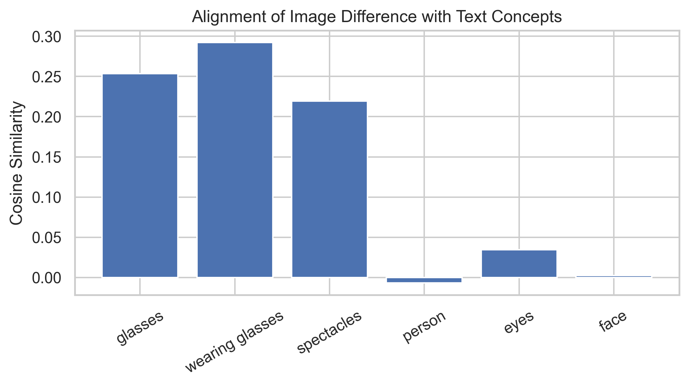
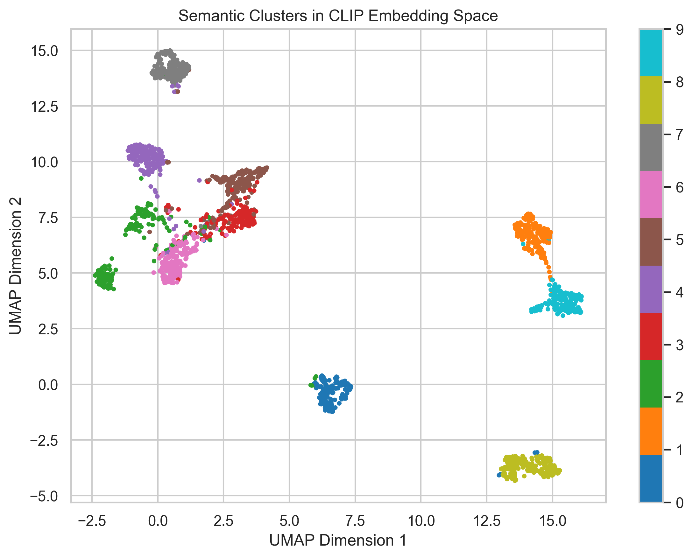
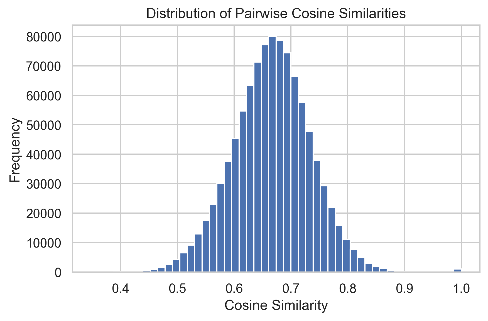
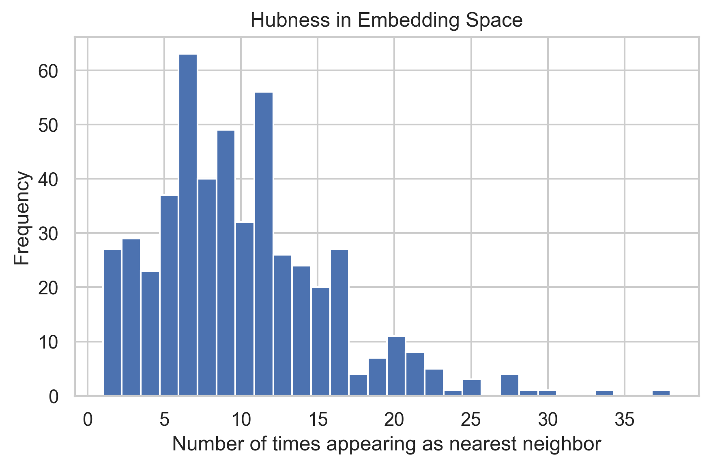
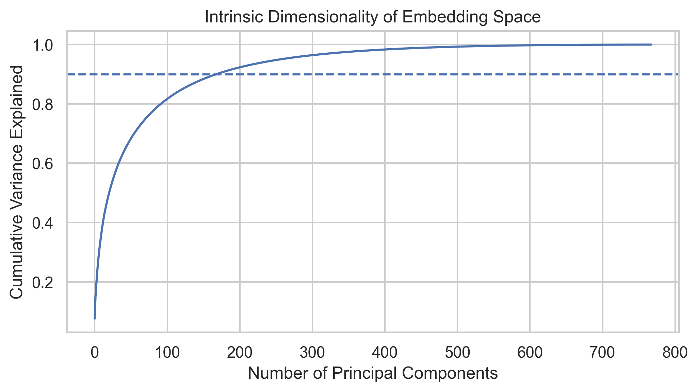

# Geometry of Embedding Spaces

Modern machine learning models represent data using **embeddings** ---
high-dimensional vectors that encode semantic meaning.

Models such as **CLIP**, **BERT**, and **Sentence Transformers** map
inputs (text, images, audio, etc.) into a vector space where:

-   distance corresponds to similarity
-   direction corresponds to semantic attributes
-   clusters represent related concepts

This repository explores the **geometry of embedding spaces** through a
series of small, reproducible experiments.

Rather than treating embeddings as opaque features, the goal is to
**visualize and analyze the structure that emerges inside these learned
spaces**.

Each experiment generates both **quantitative results and
visualizations** demonstrating a specific property of modern embeddings.

------------------------------------------------------------------------

# Experiments

The repository contains **six experiments** illustrating key geometric
properties of embedding spaces.

------------------------------------------------------------------------

# 1. Semantic Vector Arithmetic (CLIP)

Many embedding spaces exhibit **linear semantic structure**.

Vector differences between embeddings often correspond to meaningful
**semantic directions**.

Example intuition:

    embedding(person_with_glasses)
    -
    embedding(person_without_glasses)
    ≈ embedding("glasses")

### Example Images

Below is an example pair representing **with glasses vs without glasses**.

*Image credit: https://www.opticstown.com/a/blog/media/rvroptics.myshopify.com/Post/featured_img/1-3-5.jpg*

This experiment demonstrates that the **difference between two image
embeddings aligns with the text embedding of the concept**.

We compute cosine similarity between:

    (image_with_glasses − image_without_glasses)

and several candidate text concepts.

## Result

The correct concept direction should produce the **highest similarity
score**.

------------------------------------------------------------------------

# 2. Semantic Clustering in Embedding Space

Even when models are not explicitly trained for classification,
embeddings often **cluster according to semantic categories**.

In this experiment we:

1.  Embed images from **CIFAR-10**
2.  Use **CLIP image embeddings**
3.  Project embeddings into 2D using **UMAP**

## Result

Objects with similar meaning cluster together:

-   airplanes
-   trucks
-   dogs
-   cats

This demonstrates that embedding spaces capture **high-level semantic
relationships**.

------------------------------------------------------------------------

# 3. Embedding Space Anisotropy

Ideally, embedding vectors would be **uniformly distributed across
space**.

However, many modern embedding spaces are **anisotropic** --- vectors
occupy a narrow cone instead of spreading evenly.

We test this by computing cosine similarities between **random pairs of
sentence embeddings**.

## Observation

Instead of being centered around **0**, cosine similarities are biased
toward **positive values**.

This phenomenon has been widely observed in **BERT-like models**.

------------------------------------------------------------------------

# 4. Hubness in High-Dimensional Spaces

High-dimensional vector spaces often exhibit a phenomenon called
**hubness**.

Some vectors appear as the **nearest neighbor of many other vectors**,
acting as hubs in the embedding space.

This experiment:

1.  Embeds a large set of sentences
2.  Computes nearest neighbors
3.  Counts how often each vector appears as a neighbor

## Result

A small number of vectors appear extremely frequently.

Hubness can negatively impact:

-   similarity search
-   recommendation systems
-   nearest neighbor retrieval

------------------------------------------------------------------------

# 5. Concept Directions

Concepts often emerge as **directions in embedding space**.

For example, sentiment can be approximated as:

    mean(positive_embeddings) - mean(negative_embeddings)

This produces a **sentiment direction**.

We then measure how strongly new sentences align with this direction.

Applications include:

-   concept probing
-   representation analysis
-   interpretability

------------------------------------------------------------------------

# 6. Intrinsic Dimensionality

Although embeddings may have **hundreds or thousands of dimensions**,
the effective dimensionality is often much smaller.

We measure intrinsic dimensionality using **Principal Component Analysis
(PCA)**.

Typical observation:

    ~90% of variance captured by < 100 dimensions

This suggests embeddings lie on **low-dimensional manifolds embedded in
high-dimensional space**.

------------------------------------------------------------------------

# Repository Structure

    embedding-space-blog/

    ├── README.md
    ├── requirements.txt

    ├── data/
    │   └── images/
    │       ├── glasses/
    │       └── no_glasses/

    ├── src/
    │   ├── config.py
    │   ├── utils.py
    │   ├── clip_utils.py
    │   └── text_utils.py

    ├── experiments/
    │   ├── 1_clip_vector_arithmetic.py
    │   ├── 2_clip_clustering_umap.py
    │   ├── 3_embedding_anisotropy.py
    │   ├── 4_hubness_analysis.py
    │   ├── 5_concept_direction.py
    │   └── 6_intrinsic_dimension.py

    └── figures/

------------------------------------------------------------------------

# Installation

Clone the repository:

    git clone <repo-url>
    cd embedding-space-blog

Install dependencies:

    pip install -r requirements.txt

------------------------------------------------------------------------

# Running Experiments
Each experiment is independent.

Example:
    python experiments/1_clip_vector_arithmetic.py

Other experiments:
    python experiments/2_clip_clustering_umap.py
    python experiments/3_embedding_anisotropy.py
    python experiments/4_hubness_analysis.py
    python experiments/5_concept_direction.py
    python experiments/6_intrinsic_dimension.py

Generated figures will appear in:
    figures/

------------------------------------------------------------------------

# Requirements

Key libraries used in this project:

-   PyTorch
-   OpenCLIP
-   HuggingFace Transformers
-   scikit-learn
-   UMAP
-   matplotlib
-   seaborn

------------------------------------------------------------------------

# Why These Experiments Matter

Embedding spaces power most modern ML systems:

-   Large Language Models
-   Vision models
-   Multimodal models
-   Retrieval systems
-   Recommendation engines

Understanding their geometry helps explain why these models behave the
way they do.

Key insights illustrated in this repository:

-   Meaning emerges as **directions in vector space**
-   Semantic structure forms **clusters**
-   Embedding spaces exhibit **anisotropy**
-   High-dimensional spaces produce **hubness**
-   Concepts can be approximated as **linear directions**
-   Embeddings often lie on **low-dimensional manifolds**

------------------------------------------------------------------------

# References

Radford, A., Kim, J. W., Hallacy, C., et al. (2021).\
Learning Transferable Visual Models From Natural Language Supervision.\
ICML.\
https://arxiv.org/abs/2103.00020

Devlin, J., Chang, M. W., Lee, K., & Toutanova, K. (2019).\
BERT: Pre-training of Deep Bidirectional Transformers for Language
Understanding.\
NAACL.\
https://arxiv.org/abs/1810.04805

Kim, B., Wattenberg, M., Gilmer, J., et al. (2018).\
Interpretability Beyond Feature Attribution: Quantitative Testing with
Concept Activation Vectors (TCAV).\
ICML.\
https://arxiv.org/abs/1711.11279

Radovanović, M., Nanopoulos, A., & Ivanović, M. (2010).\
Hubs in Space: Popular Nearest Neighbors in High-Dimensional Data.\
Journal of Machine Learning Research.\
https://jmlr.org/papers/v11/radovanovic10a.html

Reimers, N., & Gurevych, I. (2019).\
Sentence-BERT: Sentence Embeddings using Siamese BERT-Networks.\
EMNLP.\
https://arxiv.org/abs/1908.10084

------------------------------------------------------------------------

# Reproducibility

All experiments are designed to be:
-   small
-   fast
-   reproducible

They are suitable for:
-   teaching
-   blog demonstrations
-   representation analysis
-   embedding research exploration

------------------------------------------------------------------------

# License

MIT License
